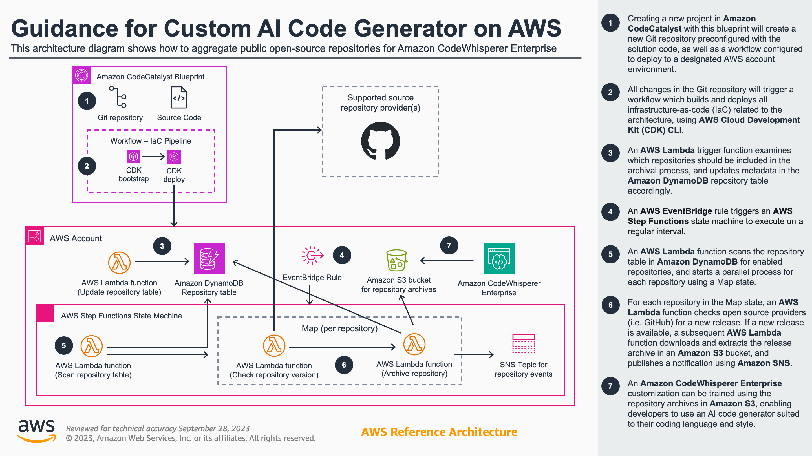

# Guidance for Custom AI Code Generator on AWS

## Table of Contents

1. [Overview](#overview)
    - [Architecture](#architecture)
    - [Cost](#cost)
2. [Prerequisites](#prerequisites)
    - [Operating System](#operating-system)
    - [Third-party tools](#third-party-tools)
    - [AWS CDK bootstrap](#aws-cdk-bootstrap)
    - [Supported Regions](#supported-regions)
3. [Deployment Steps](#deployment-steps)
4. [Deployment Validation](#deployment-validation)
5. [Running the Guidance](#running-the-guidance)
6. [Next Steps](#next-steps)
7. [Cleanup](#cleanup)
8. [FAQ, known issues, additional considerations, and limitations](#faq-known-issues-additional-considerations-and-limitations-optional)
9. [Notices](#notices-optional)

## Overview

This automated solution enables customers to leverage public open source repositories to train more robust Amazon CodeWhisperer Enterprise customizations. By orchestrating the process of detecting, downloading, and preparing new repository releases, this architecture provides seamless access to a wealth of up-to-date training data. Customers can focus on configuring the repositories they want to pull from instead of building complex workflows for sourcing public data. The event-driven automation checks for the latest releases and makes extracted assets readily available in Amazon S3 for training customizations. Rather than being limited to private repositories connected through CodeStar, customers can now tap into public open source code at scale to create CodeWhisperer customizations finely tuned to their needs, drawing on the most current repositories. This architecture unlocks the full potential of CodeWhisperer by enabling customers to leverage public data and achieve customizations with greater relevance powered by the most recent code.

### Architecture



### Cost

You are responsible for the cost of the AWS services used while running this Guidance. As of October 2023, the cost for running this Guidance with the default settings in the US East (N. Virginia) AWS Region is approximately **$17 per month**, using the following assumptions:

- 20 repositories checked every 60 minutes
- The size of repository releases average 50MB each
- SNS notifications sent to 10 subscribers

## Prerequisites

### Operating System

This Guidance is compatible with Mac, Linux, and Windows operating systems.

### Third-party tools

- [AWS Cloud Development Kit (AWS CDK) v2](https://docs.aws.amazon.com/cdk/v2/guide/home.html)
- TypeScript 3.8 or later (```npm -g install typescript```)
- [AWS Command Line Interface (CLI)](https://aws.amazon.com/cli/) (optional)

### AWS CDK bootstrap

This Guidance uses AWS CDK. Bootstrapping is the process of provisioning resources for the AWS CDK before you can deploy AWS CDK apps into an AWS environment. (An AWS environment is a combination of an AWS account and Region). If you are using AWS CDK for the first time in an AWS environment, please run the following bootstrapping command:

```cdk bootstrap aws://ACCOUNT-NUMBER/REGION```

For additional information or customizations with AWS CDK bootstrapping, see [Bootstrapping](https://docs.aws.amazon.com/cdk/v2/guide/bootstrapping.html) in the AWS CDK documentation.

### Supported Regions

CodeWhisperer is currently hosted in `us-east-1` (the US East (N. Virginia) Region). To support Amazon CodeWhisperer Enterprise customizations using Amazon S3, this Guidance must also be deployed in `us-east-1` (the US East (N. Virginia) Region).

## Deployment Steps

### Option 1: Deploy via Amazon CodeCatalyst blueprint

1. Create a new project in Amazon CodeCatalyst
2. Select **Start with a blueprint** and choose the **Custom AI Code Generator** blueprint. Click **Next**.
3. Give your project a name.
4. Select an AWS account, IAM role, and AWS region.
5. Click **Create project**.
 
### Option 2: Manually deploy CDK application

1. Clone the repo using command ```git clone https://github.com/aws-solutions-library-samples/guidance-for-custom-ai-code-generator-on-aws.git```
2. Change the current directory to the repo folder using command ```cd guidance-for-custom-ai-code-generator-on-aws```
3. Install required packages in using command ```npm install```
4. Edit the ```public_github_repos``` array attribute in **cdk.json** to include strings of the repositories you'd like to include in Amazon CodeWhisperer customizations. The string format is ```GITHUB_ORG/REPOSITORY_NAME```.
5. Change the current directory to the `source` folder using command ```cd source```
6. Deploy the stack using the command ```cdk deploy``` 
7. Enter `y` when prompted with the question, ```Do you wish to deploy these changes (y/n)?```

## Deployment Validation

To validate deployment, use one or more of the following methods:

- From the [AWS Management Console](https://console.aws.amazon.com) in your web browser, open the CloudFormation console, click **Stacks** on the left-hand menu, and verify the stack with the name **CustomAiCodeGeneratorStack** has a status of **CREATE_COMPLETE**.
- If AWS CLI is installed, run the following command to validate the deployment has a status of **CREATE_COMPLETE**: 
    
    ```aws cloudformation describe-stacks --stack-name CustomAiCodeGeneratorStack```

## Running the Guidance

* Guidance inputs
* Commands to run
* Expected output (provide screenshot if possible)
* Output description

## Next Steps

Provide suggestions and recommendations about how customers can modify the parameters and the components of the Guidance to further enhance it according to their requirements.

## Cleanup

To delete and cleanup deployed resources, use one or more of the following methods:

- To cleanup with AWS CDK:
    - If not currently in the `source` directory, run the command ```cd source```
    - Run the command ```cdk destroy```
    - Enter `y` for the following prompt.
- From the [AWS Management Console](https://console.aws.amazon.com) in your web browser, open the CloudFormation console, click **Stacks** on the left-hand menu, select the stack with the name **CustomAiCodeGeneratorStack**, and click **Delete**.
- If AWS CLI is installed, run the following command: 
    

    ```aws cloudformation delete-stack --stack-name CustomAiCodeGeneratorStack```

## Limitations and feedback

**Limitations**

- Supported open-source repository provider(s) are limited to **GitHub** only
- Supported AWS Region(s) for this implementation are limited to **`us-east-1` (the US East (N. Virginia) Region)** only (see [Supported Regions](#supported-regions))

**Feedback**

For any feedback, questions, or suggestions, please [submit a new issue](https://github.com/aws-solutions-library-samples/guidance-for-custom-ai-code-generator-on-aws/issues/new/choose).

## Notices

*Customers are responsible for making their own independent assessment of the information in this Guidance. This Guidance: (a) is for informational purposes only, (b) represents AWS current product offerings and practices, which are subject to change without notice, and (c) does not create any commitments or assurances from AWS and its affiliates, suppliers or licensors. AWS products or services are provided “as is” without warranties, representations, or conditions of any kind, whether express or implied. AWS responsibilities and liabilities to its customers are controlled by AWS agreements, and this Guidance is not part of, nor does it modify, any agreement between AWS and its customers.*
